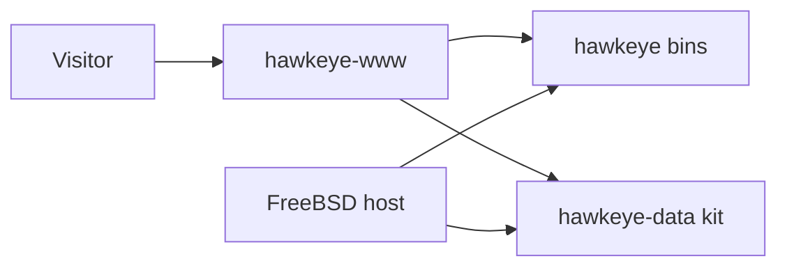

# Hawkeye repository map

```mermaid
flowchart LR
  visitor[Visitor] --> www[hawkeye-www]
  www --> bins[hawkeye bins]
  www --> data[hawkeye-data kit]
  host[FreeBSD host] --> bins
  host --> data
```

Hawkeye-www is the public docs site only. Diagnose and apply run on the host, from the hawkeye binaries plus hawkeye-data.
